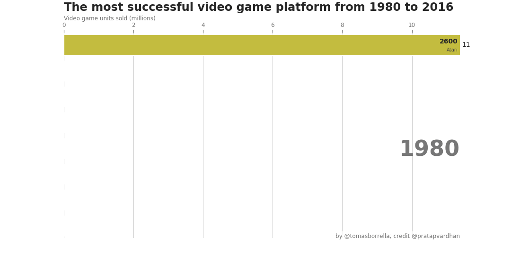
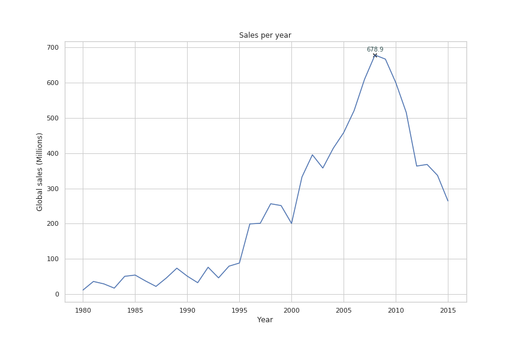
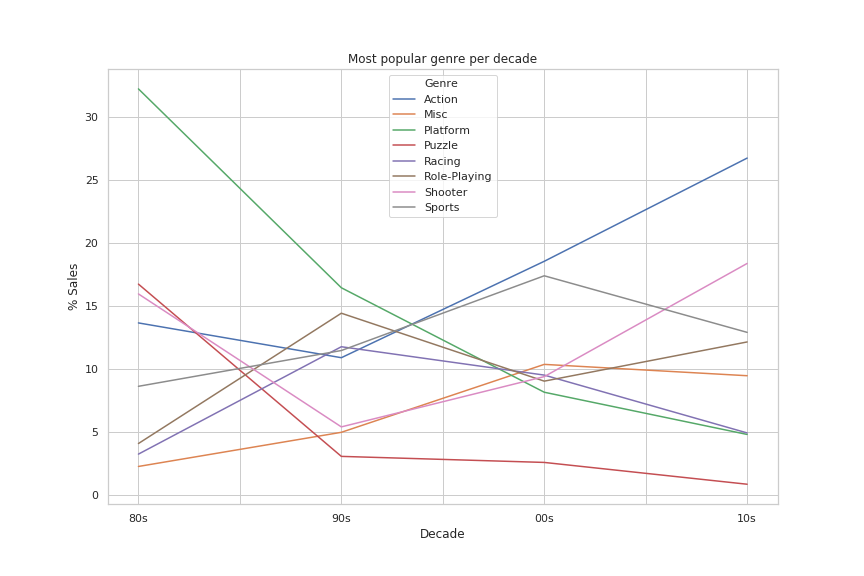

# Video game sales analysis

## Installations

Project created using:
```
Python 3.7.6
```

Additional packages and versions used:
```
pandas 1.0.1
numpy 1.18.1
matplotlib 3.1.3
seaborn 0.10.0
ipython 7.12.0
```

## Project Motivation

I'm passionate about video games. I was curious to answer some questions related to games, consoles and trends and I decided to look for answers in the data:

1 - What is the most successful video game console in history?

2 - Is there a growing trend in the video game market?

3 - What is the most successful video game genre in each decade? Have gamers' preferences changed over time?

## File Descriptions

```text
video-game-sales-analysis/
├── data/
│   └── vgsales.csv.zip
├── images/
│   ├── animation-00.png
.   .   [...]
│   ├── animation-39.png
│   ├── animation.gif
│   ├── exploratory-1.png
│   ├── exploratory-2.png
│   ├── question2.png
│   ├── question3-1.png
│   └── question3-2.png
└── notebook/
    └── video-game-sales-analysis.ipynb
```

The only notebook in the project contains all the code of the analysis (notebook/video-game-sales-analysis.ipynb).

The data was downloaded from Kaggle:
[Video Game Sales](https://www.kaggle.com/gregorut/videogamesales)
(data/vgsales.csv.zip).

The image folder contains all the images generated during the analysis (code in the notebook).

## Results

I've published a Data Storytelling post to share my results. You can find it here:
[What is the most successful video game platform in history?](https://medium.com/@tomasborrella/what-is-the-most-successful-video-game-platform-in-history-a18dfab20a41)

#### 1 - What is the most successful video game console in history?

The data was collected in mid-2016, so we can only answer the question until then.

I have considered that the most successful console is the one with the highest sales of video game units worldwide. And the winner is **PlayStation 2**, with more than 1.200 Million units sold.



#### 2 - Is there a growing trend in the video game market?

I always thought that the video game market had not stopped growing and had not yet found its limit, but the data shows that it reached the maximum number of units sold in 2008 and that since then the trend is downwards.



Note: No price information is available in the dataset, so it is not possible to know whether turnover has grown or not. At this point we are only talking about units sold

#### 3 - What is the most successful video game genre in each decade? Have gamers' preferences changed over time?

The 2 most popular genres in the 80's in the origins of home video games (Platforms and Puzzle) have been losing popularity over time.

Currently the two most successful genres are: Action and Shooter.

Curiously the Shooter genre was in third place in the 80's, then it lost popularity and has lived a resurgence until placing itself in second place in the 10s.



## Acknowledgements

Bar chart race was inspired by Pratap Vardhan' post:
https://towardsdatascience.com/bar-chart-race-in-python-with-matplotlib-8e687a5c8a41
